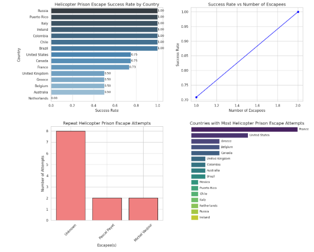

# Helicopter Prison Escape Analysis with Moyo

# Hey There!,

## Project Overview
This project analyzes historical data on helicopter prison escape attempts, sourced from [Wikipedia](https://en.wikipedia.org/wiki/List_of_helicopter_prison_escapes#Actual_attempts). The analysis answers key questions such as:

1. **In which year did the most helicopter prison escape attempts occur?**
2. **In which countries do the most attempted helicopter prison escapes occur?**
3. **In which countries do helicopter prison breaks have a higher chance of success?**
4. **How does the number of escapees affect the success of an escape?**
5. **Which escapees have done it more than once?**

The analysis includes data cleaning, exploration, visualization, and a summary presented on a Python-generated dashboard.

## Prerequisites
Ensure you have the following installed on your machine:

- Python 3.x
- Jupyter Notebook or JupyterLab
- Required Python libraries:
  - `helper.py`
  - `pandas`
  - `matplotlib`
  - `seaborn`
  - `dash`
 
## Analysis Process

### 1. Data Collection
The data was scraped from the Wikipedia page "[List of helicopter prison escapes](https://en.wikipedia.org/wiki/List_of_helicopter_prison_escapes#Actual_attempts)" and imported into a Jupyter Notebook for analysis.

---

### 2. Data Cleaning and Exploration
Steps:
- Removing/dropping column(s).
- Adopted imputation for missing prisoner name
- Converted date fields to year objects for easy analysis.

---
# Example of data cleaning
date = "July 23, 2009"
year = fetch_year("July 23, 2009")
print(year)

---
### 3. Data Exploration and Visualization

#### Question 1: In which year did the most attempts occur?
- Grouped the data by year and counted the number of attempts.
- Find the Max and Min Year
- Created a bar chart to visualize the trends over time.

#### Question 2: In which countries do the most attempted helicopter prison escapes occur?
- Counted the number of attempts per country.
- Visualized the results using table.

#### Question 3: In which countries do helicopter prison breaks have a higher chance of success?
- Calculated the success rate of escapes per country.
- Used a bar chart to show success rates.

#### Question 4: How does the number of escapees affect the success?
- Analyzed the relationship between the number of escapees and the success of the escape.
- Created a scatter plot to illustrate the trend.

#### Question 5: Which escapees have done it more than once?
- Analyzed the prisoners who had escaped more than once.
- Created a barchart plot to illustrate the trend.

 

---

### 4. Dashboard Creation
A summary dashboard was built using Dash to present:
- Key statistics.
- Static visualizations for exploring the data.

